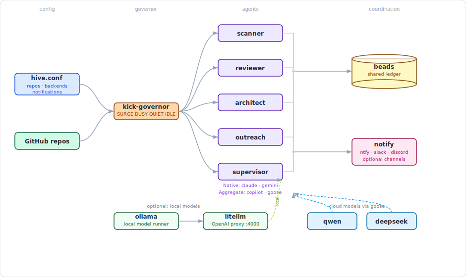

# hive

**One command starts everything. Your phone, Slack, or Discord buzzes if anything needs you.**

---



---

## Setup

```bash
# 1. install tmux
sudo apt install tmux

# 2. install hive
curl -fsSL https://raw.githubusercontent.com/kubestellar/hive/main/install.sh | sudo bash

# 3. configure
sudo nano /etc/hive/hive.conf

# 4. start
hive supervisor
```

That's it. `hive supervisor` installs missing tools, starts all agents, sets the kick cadence, and launches the supervisor. No tmux knowledge needed.

---

## Commands

```bash
hive supervisor             # start everything
hive status                 # live terminal dashboard
hive status --json          # machine-readable JSON output
hive status --watch 5       # auto-refresh every 5 seconds (in-place overwrite)
hive dashboard              # launch web dashboard (port 3001)
hive attach supervisor      # watch the supervisor  (Ctrl+B D to leave)
hive attach scanner         # watch any agent

hive kick all               # immediate kick to all agents
hive kick scanner           # kick one agent

hive switch scanner claude  # switch agent to a different CLI backend
hive switch reviewer copilot

hive logs governor          # tail governor decisions
hive logs scanner           # tail any agent's service log

hive stop all               # stop everything
```

---

## Web Dashboard

`hive dashboard` launches a real-time web dashboard on port 3001.

- **Live updates** via SSE — agent states, governor mode, repo counts, and beads refresh every 5 seconds
- **Kick buttons** — one-click kick for any agent
- **Switch dropdown** — switch agent CLI backend (copilot, claude, gemini, goose) from the UI
- **Übersicht widget** — download a macOS desktop widget from the ⬇ Widget button in the header

The dashboard runs as a systemd service (`hive-dashboard.service`) and auto-restarts on failure.

```bash
# Manual access
open http://192.168.4.56:3001    # from LAN
open http://localhost:3001       # from hive itself

# Install Übersicht widget (macOS)
curl -sf http://192.168.4.56:3001/api/widget | tar xzf - -C "$HOME/Library/Application Support/Übersicht/widgets/"
```

---

## How it works

The **kick-governor** measures issue and PR backlog across your repos every 15 minutes and picks a mode:

| Mode | Trigger | Scanner | Reviewer | Architect | Outreach | Supervisor |
|------|---------|---------|----------|-----------|----------|-----------|
| SURGE | queue > 20 | 10 min | 10 min | **paused** | **paused** | 30 min |
| BUSY  | queue > 10 | 15 min | 15 min | **paused** | **paused** | 30 min |
| QUIET | queue > 2  | 15 min | 30 min | 1 h        | 2 h        | 30 min |
| IDLE  | queue ≤ 2  | 30 min | 1 h    | 30 min     | 30 min     | 30 min |

Architect and outreach are **opportunistic** — they fill idle cycles and pause entirely under load. Supervisor runs every 30 min regardless of mode.

Cadences are tunable in `/etc/hive/governor.env` — no restart needed.

---

## Backends

Set `HIVE_BACKENDS` in `hive.conf`. `HIVE_AUTO_INSTALL=true` installs missing backends on startup.

| Backend | Type | Models |
|---------|------|--------|
| `copilot` | Cloud | Claude Sonnet/Opus via GitHub Copilot |
| `claude` | Cloud | Claude Sonnet/Opus via Anthropic |
| `gemini` | Cloud | Gemini Pro/Flash via Google |
| `goose` | Cloud or local | Any model via config |

### Local models (optional)

Set `HIVE_MODEL_SERVICES="ollama litellm"` to run models on-device with no API costs.

```
ollama        → runs local models (llama3, codestral, qwen2.5-coder, ...)
    └── litellm proxy :4000  ← unified OpenAI-compatible endpoint
            └── goose        ← points here when AGENT_BACKEND=goose
```

Ollama and litellm start as background services before any agent session launches.

---

## Notifications

hive sends alerts to any combination of ntfy, Slack, and Discord. Set whichever you use in `hive.conf` — all three fire simultaneously if configured.

| Channel | Config key | How to get it |
|---------|-----------|---------------|
| ntfy (phone push) | `NTFY_TOPIC` | Free at [ntfy.sh](https://ntfy.sh) — pick any topic string |
| Slack | `SLACK_WEBHOOK` | api.slack.com/apps → Incoming Webhooks |
| Discord | `DISCORD_WEBHOOK` | Channel Settings → Integrations → Webhooks |

---

## Config

`/etc/hive/hive.conf` — the only file you need to edit:

```bash
# Repos to watch (space-separated)
HIVE_REPOS="owner/repo1 owner/repo2"

# Agent CLI backends to use (space-separated)
HIVE_BACKENDS="copilot"          # copilot claude gemini goose

# Local model services (optional — needs GPU or fast CPU)
# HIVE_MODEL_SERVICES="ollama litellm"

# Auto-install missing backends on hive supervisor start
HIVE_AUTO_INSTALL=true

# Notifications — set any combination
NTFY_TOPIC=your-secret-topic     # free at ntfy.sh
# SLACK_WEBHOOK=https://hooks.slack.com/services/...
# DISCORD_WEBHOOK=https://discord.com/api/webhooks/...
```

---

## Troubleshooting

```bash
hive status                  # check what's running
hive logs governor           # why did it kick / not kick?
hive logs scanner            # what is scanner doing?
hive attach supervisor       # watch supervisor live
journalctl -u claude-scanner # raw service log
```

### Common issues

| Symptom | Cause | Fix |
|---------|-------|-----|
| All agents idle, no ntfy | Governor crashing (check `hive logs governor`) | See below |
| Governor: `Permission denied` on `/var/run/kick-governor/` | Root-owned files from `sudo` operations | `sudo chown -R dev:dev /var/run/kick-governor/` |
| Governor: `Slack: command not found` | Broken comments in `notify.sh` | Reinstall: `sudo cp bin/notify.sh /usr/local/bin/notify.sh` |
| Governor: `$2: unbound variable` | `set -u` + missing arg defaults | Use `${N:-}` syntax in all function params |
| Dashboard: agents show `stopped` / CLI `?` | Service running as root (can't see dev's tmux) | Add `User=dev` to `hive-dashboard.service` |
| Dashboard: widget download 404 | Stale node process on port 3001 | `ss -tlnp \| grep 3001` → `kill <PID>` → restart service |
| `bd dolt push` fails | Root-owned `.beads/` files | `sudo chown -R dev:dev ~/.beads/ /home/dev/scanner-beads/.beads/` |

---

Apache 2.0  ·  [Architecture](docs/architecture.md)  ·  [KubeStellar example](examples/kubestellar/)
