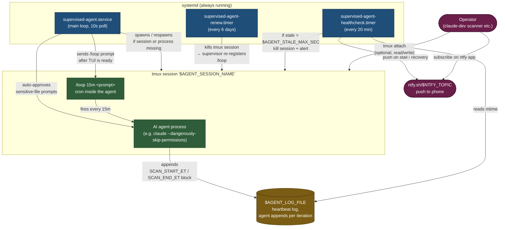

# supervised-agent

Keep a long-running AI agent (e.g. [Claude Code](https://www.anthropic.com/claude-code)) alive **24/7** inside a tmux session — with crash recovery, automatic `/loop` cron renewal, and stall detection that pushes a phone notification when something goes wrong.

Originally built to run a GitHub issue-scanner against the [KubeStellar](https://kubestellar.io) organization, but the runtime is agent-agnostic. Point it at any command that produces terminal output and knows how to scan / watch / audit on a schedule.

---

## What problem does this solve?

Running an AI agent as "always-on automation" naively looks like:

```sh
tmux new-session -d -s agent 'claude --dangerously-skip-permissions -p "/loop 15m do the thing"'
```

But that setup silently falls over in four ways:

1. **The agent process dies** (OOM, crash, network blip) → tmux session survives but nothing is running.
2. **The agent writes its `/loop` cron** which Claude Code auto-expires after **7 days** → everything silently stops.
3. **The agent gets stuck on a permission prompt or thinking loop** → looks alive from the outside but does no work.
4. **You never find out**, because the only place the failure is visible is on a box you don't actively watch.

This repo is the four systemd components that patch those holes:

| Component | Failure mode it covers |
|---|---|
| `supervised-agent.service` | Process crash — respawns within ~10s |
| `supervised-agent-renew.timer` | `/loop` cron TTL expiry — renews every 6 days |
| `supervised-agent-healthcheck.timer` | Agent alive but not working — watches a heartbeat file, respawns on stall |
| ntfy.sh push inside healthcheck | You not knowing — phone alerts on stall + on recovery |

---

## Architecture



See [docs/architecture.md](docs/architecture.md) for the detailed failure-mode table.

---

## Prerequisites

- Linux with systemd (Ubuntu / Debian / RHEL / Fedora all fine)
- `tmux`, `curl`, `bash`
- The AI agent CLI on `PATH` (e.g. `claude` from Claude Code installed system-wide)
- A Unix user that will own the session (e.g. `dev`) — **not** `root`
- Optional: an account on [ntfy.sh](https://ntfy.sh) + the ntfy mobile app for push alerts

---

## Quick start

```sh
git clone https://github.com/kubestellar/supervised-agent.git
cd supervised-agent

# 1. copy the env template and edit it
sudo mkdir -p /etc/supervised-agent
sudo cp config/agent.env.example /etc/supervised-agent/agent.env
sudo $EDITOR /etc/supervised-agent/agent.env   # set AGENT_USER, AGENT_WORKDIR, AGENT_LOOP_PROMPT, AGENT_LOG_FILE, NTFY_TOPIC

# 2. install scripts + systemd units
sudo ./install.sh

# 3. verify
systemctl status supervised-agent.service
systemctl list-timers supervised-agent-renew.timer supervised-agent-healthcheck.timer
```

To remove everything:

```sh
sudo ./uninstall.sh
```

### Attaching to the session

```sh
# from the same host
sudo -u $AGENT_USER tmux attach -t $AGENT_SESSION_NAME

# from a remote operator box (SSH wrapper pattern)
ssh -t user@host "tmux attach -t $AGENT_SESSION_NAME"
```

Detach with `Ctrl+B, D`. The session keeps running. The supervisor keeps watching. The world is OK.

---

## Push notifications via ntfy.sh

The healthcheck component can push a phone notification on three events:

| Event | Priority | Tag |
|---|---|---|
| **Stall detected — auto-respawning** | `high` | ⚠️ 🔄 |
| **Stall persists after 3 respawns — manual help needed** | `urgent` | 🔥 🚨 |
| **Recovered — heartbeat resumed** | `default` | ✅ |

### One-time setup

1. **Install the ntfy app** — [iOS](https://apps.apple.com/app/ntfy/id1625396347) · [Android](https://play.google.com/store/apps/details?id=io.heckel.ntfy).
2. **Pick a topic name.** Topic = only auth on ntfy.sh, so pick something unguessable:
   ```sh
   uuidgen
   # e.g. 7f2a8e1c-6b4d-49f2-9a1b-d3f7e08b2c4a
   ```
3. **Subscribe in the app:** tap `+` → paste the topic → Subscribe. Leave notifications enabled.
4. **Test from your laptop:**
   ```sh
   curl -d "hello from supervised-agent" ntfy.sh/<your-topic>
   ```
   You should get a push within a second or two.
5. **Set `NTFY_TOPIC` in `/etc/supervised-agent/agent.env`** and restart the healthcheck timer:
   ```sh
   sudo systemctl restart supervised-agent-healthcheck.timer
   ```

### Disabling push

Leave `NTFY_TOPIC` blank or comment it out. The healthcheck still respawns on stalls — it just won't push.

### Alternatives

Swap the `notify()` function in `bin/agent-healthcheck.sh` for a Slack webhook, a Discord webhook, a self-hosted ntfy instance, `sendmail`, or anything else that takes a POST / command-line invocation. The healthcheck logic is independent of the transport.

---

## Environment variables

All configuration lives in `/etc/supervised-agent/agent.env`. Systemd loads it via `EnvironmentFile=` for every unit.

| Variable | Required | Default | Purpose |
|---|---|---|---|
| `AGENT_USER` | yes | — | Unix user the session runs as (NOT `root`) |
| `AGENT_SESSION_NAME` | no | `supervised-agent` | tmux session name |
| `AGENT_WORKDIR` | yes | — | cwd for the agent process |
| `AGENT_LAUNCH_CMD` | yes | — | Shell command that starts the agent in the foreground (e.g. `claude --dangerously-skip-permissions --model claude-opus-4-6`) |
| `AGENT_LOOP_PROMPT` | yes | — | Text sent to the agent after the TUI is ready. Usually `/loop 15m <your instructions>` |
| `AGENT_READY_MARKER` | no | `bypass permissions on` | String the supervisor waits to see in the pane before sending the `/loop` prompt (so the agent TUI is actually listening) |
| `AGENT_READY_TIMEOUT_SEC` | no | `45` | Max seconds to wait for the ready marker |
| `AGENT_POLL_SEC` | no | `10` | Supervisor's health-check interval |
| `AGENT_AUTO_APPROVE_PHRASE` | no | `Yes, and always allow access to` | If present in the pane, supervisor auto-sends `Down Enter` (handy for Claude Code's "sensitive file" prompt). Set blank to disable. |
| `AGENT_AUTO_DISMISS_PHRASES` | no | (blank) | Newline-separated list of phrases to dismiss with `Escape` when seen. Useful for Claude Code's periodic "How is Claude doing this session?" feedback poll. |
| `AGENT_LOG_FILE` | yes | — | Path the agent appends its heartbeat to; healthcheck watches mtime |
| `AGENT_STALE_MAX_SEC` | no | `1800` | Seconds of log silence before healthcheck considers the agent stalled |
| `AGENT_MAX_RESPAWNS` | no | `3` | Consecutive failed respawns before healthcheck stops auto-respawning and sends an escalation ntfy |
| `NTFY_TOPIC` | no | (disabled) | ntfy.sh topic for push alerts. Leave blank to run without push alerts. |

---

## Telling the agent what to do

The supervisor just *sends* `AGENT_LOOP_PROMPT` into the tmux pane after the agent is ready. What that prompt says is entirely up to you.

Typical pattern: keep the prompt **short** and point the agent at a policy file you edit separately. That way you can change the agent's behavior by editing one markdown file instead of re-registering the cron.

### The one policy rule you can't skip

Make the **very first thing in your policy** a directive to re-read the policy file from disk at the start of every iteration. Without this, the agent loads your policy once at session start and then ignores edits until the next respawn — you'll think you changed the rules, but the live agent keeps doing the old thing until the renew timer fires 6 days later.

The example policy in [`examples/scanner-policy.md`](examples/scanner-policy.md) shows the exact pattern under "Step 0 — pre-flight re-read".

See the same file for a full GitHub issue-scanner policy used against KubeStellar repos (the original use case), including an optional site-health + adoption digest pattern.

---

## Troubleshooting

See [docs/troubleshooting.md](docs/troubleshooting.md). The most common gotchas:

- **`/loop` cron never fires** → `AGENT_READY_MARKER` doesn't match your agent's TUI text. Update the env and restart.
- **Agent prompt interrupts the loop** → set `AGENT_AUTO_APPROVE_PHRASE` to the exact text of the prompt option your agent shows.
- **`systemctl restart supervised-agent` didn't pick up my new prompt** → the running supervisor bash has the old `AGENT_LOOP_PROMPT` cached in memory. You need `systemctl stop && tmux kill-session && systemctl start` for a full reset.
- **ntfy push never arrives** → test with `curl -d "test" ntfy.sh/$NTFY_TOPIC`. If that works but the healthcheck doesn't, check the service env: `systemctl cat supervised-agent-healthcheck.service`.

---

## Security notes

- The **ntfy topic** is the only auth on ntfy.sh — anyone who guesses it can read your alerts or spam you. Use something unguessable (e.g. `uuidgen` output). For higher security use a self-hosted ntfy instance or swap in webhook-to-Slack.
- Never put OAuth tokens, API keys, or credentials in `agent.env` or in systemd `Environment=` lines — they leak in `systemctl show`, journal logs, and `ps`. Mount secrets via the agent's own credential system (for Claude Code: `~/.claude/.credentials.json`).
- The agent has whatever privilege `AGENT_USER` has. Don't run this as `root`. Don't give `AGENT_USER` passwordless sudo unless you *really* mean to.

---

## License

Apache 2.0 — see [LICENSE](LICENSE).
