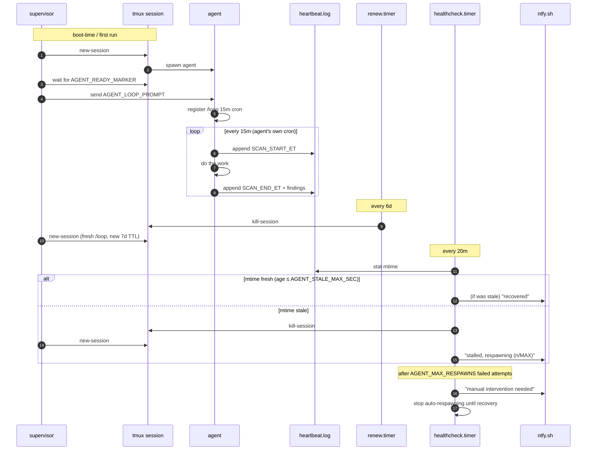

# Architecture

## Four components, four failure modes

| # | Unit | Trigger | Catches |
|---|---|---|---|
| 1 | `supervised-agent.service` | Always running; internal poll every `AGENT_POLL_SEC` (default 10s) | Agent process crash, tmux session killed, TUI-ready detection for `/loop` prompt injection, auto-approval of a known sensitive-file prompt |
| 2 | `supervised-agent-renew.timer` | Every 6 days + 5 min after boot | Claude Code `/loop` cron auto-expires at 7 days — kills the session so the supervisor re-registers a fresh one |
| 3 | `supervised-agent-healthcheck.timer` | Every 20 min + 5 min after boot | Agent is "alive" but not making progress (auth loop, stuck prompt, model stuck thinking) — watches heartbeat-file mtime |
| 4 | ntfy push inside the healthcheck | On stall, on recovery, on escalation | Operator not watching the box — phone push |

## Reactions to each failure mode

## What this deliberately does NOT handle

- **Remote box offline / network partition.** If the whole machine is down, there's no process left to push a stall alert. A secondary watcher outside the box (uptimerobot, healthchecks.io, your laptop) is the correct answer, and is out of scope for this repo.
- **ntfy.sh downtime.** Free tier, rare, tolerable. Self-host or swap the transport if you need SLAs.
- **Agent logic bugs.** If the agent decides to do nothing forever but remembers to write the heartbeat, the healthcheck won't catch it. The log format in your policy file should include non-trivial counts (repos scanned, actions taken) so you can spot a "no-op loop" visually.
- **Secrets management.** Don't put credentials in `agent.env`. The agent should source them from its own credential store (`~/.claude/.credentials.json` for Claude Code, vault / secrets manager for anything else).
